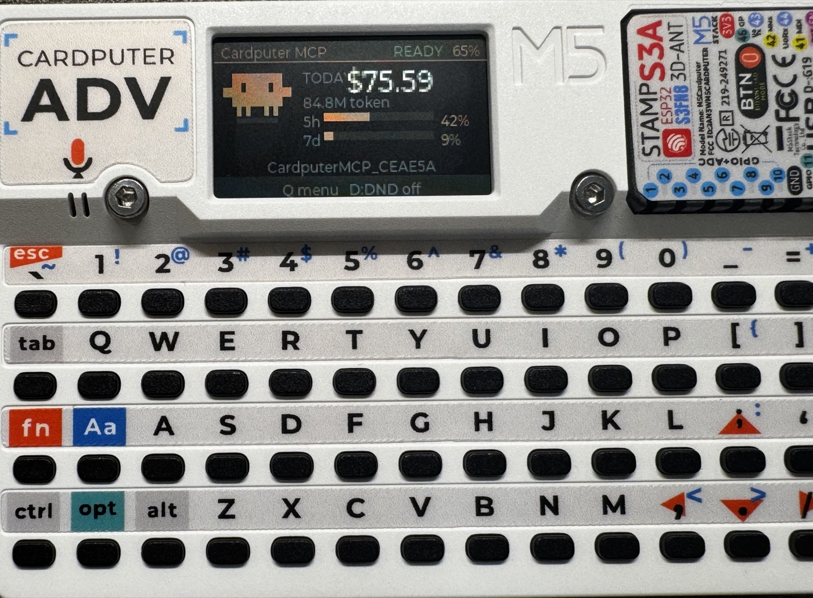
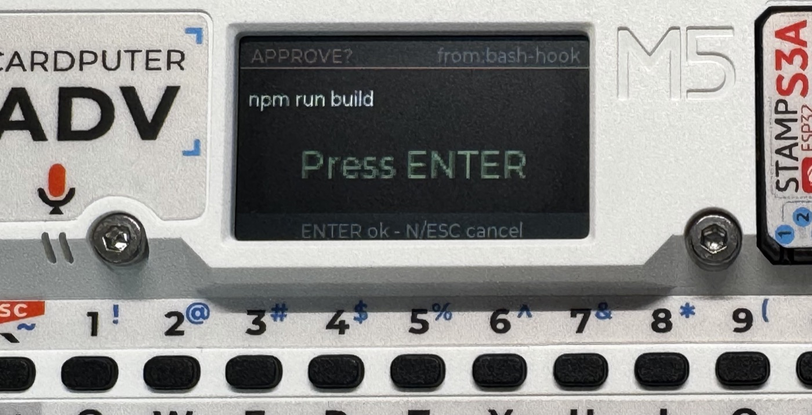
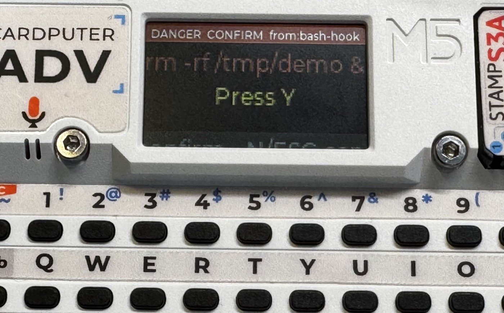

# cardputer-claude-mcp

[English](README.md) | **中文**



把一台 [M5Stack Cardputer-Adv](https://docs.m5stack.com/en/core/Cardputer-Adv)
变成 AI 编程助手的**实体控制面**。

手持设备上的一个 MicroPython 小程序通过 BLE 与 Mac 端的 MCP 桥接通信,
让 AI 助手(Claude Code 等)可以:

- **notify / ask / confirm** —— 向设备推送横幅、多选提问,以及**需要物理确认**的审批;
- **usage** —— 常驻显示实时看板(今日花费 + 5h/7d 套餐用量 + 电量),还有一只
  常驻的clawd;
- **拦截 shell** —— 一个 Claude Code hook 把 Bash 命令**和文件编辑**路由到设备上,
  执行前先审批。

最大的亮点是**审批闸门**:日常命令走白名单直接放行,普通命令在设备上按一下
**Enter**,而危险操作(`rm -rf`、`git push`、`sudo`、改密钥文件)只需在设备上**单按一次 Y**
—— 和普通确认用不同的键,且是提示注入无法伪造的物理按键。设备不在身边时,自动回落到终端原生提示 ——
Cardputer 是**可选的闸门,绝非依赖**。

| 普通操作 —— 按 Enter | 危险操作 —— 按 Y |
|:---:|:---:|
|  |  |

## 目录结构

```
device/cardputer_mcp.py   MicroPython app:BLE GATT 服务、空闲看板、
                          吉祥物动画、notify/ask/confirm/usage 界面
mcp/server.py             Mac 桥接:BLE 独占方 + MCP 工具 + 用量监控 +
                          审批闸门用的 /hook/confirm 路由
mcp/auth.py               HTTP 传输层的 bearer-token 鉴权
mac/                      launchd 桥接守护进程 + PreToolUse 审批 hook
mac/README.md             Mac 端安装与调优说明  ← 从这里开始
```

## 快速开始

1. **桥接**:`cd mcp && python3 -m venv .venv && .venv/bin/pip install -r requirements.txt`,
   然后运行 `mac/install_cardputer_bridge.sh`(见 [`mac/README.md`](mac/README.md))。
2. **设备**:`device/cardputer_mcp.py` **不能单独运行** —— 它要部署进
   [cardputer-claude-os](https://github.com/dakshaymehta/cardputer-claude-os)
   的 UIFlow 启动器套件里,由它提供 app 菜单、NimBLE 初始化,以及本 app 的 `run()`
   依赖的矩阵键盘驱动。把它编译成 **`.mpy`**(用匹配的 `mpy-cross`),放进该套件的
   `/flash/apps/`,并删除 `.py`(源码形式导入会让启动器内存溢出崩溃)。
   本仓库**有意只放这个 app,不含那套启动器框架**。
3. **审批闸门**:在 `~/.claude/settings.json` 里把 `mac/adv_confirm_hook.py` 注册为
   `PreToolUse` hook(片段见 `mac/README.md`)。

## 硬件说明(Cardputer-Adv)

- 音频是 **ES8311 codec + NS4150B 功放**。`M5.Speaker.tone()` 只有在 app 主循环**每轮调用
  `M5.update()`** 时才会出声 —— 不调它提示音就是哑的。插入 3.5mm 耳机时喇叭功放也会被禁用。
- 设备 app 必须以编译后的 `.mpy` 部署,不能用源码。

## 安全

桥接对每个 HTTP 请求都做 bearer-token 鉴权;token 只存在
`~/.config/cardputer-bridge/env`(从不提交)。设备上的物理 Y 键确认是不可逆操作的信任锚。

## 致谢

- 基于 [cardputer-claude-os](https://github.com/dakshaymehta/cardputer-claude-os) —— 本项目所扩展的 Cardputer ↔ Claude BLE 套件。
- 用量看板灵感来自 [cardputer-claude-usage](https://github.com/chixi4/cardputer-claude-usage)。
- 花费 / token 数据由 [ccusage](https://github.com/ryoppippi/ccusage) 提供。

## 许可证

[MIT](LICENSE) © 2026 neu
